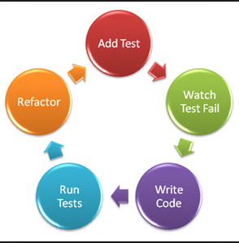
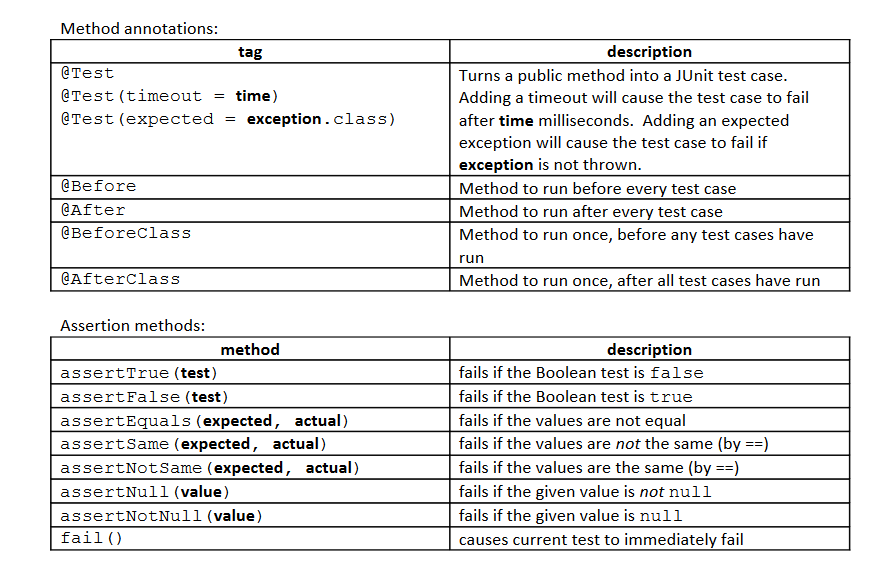

# This is an example app for ping pong pair programming demo

1. Create a basic app using maven archetype in intellij:  
**mvn archetype:generate -DarchetypeGroupId=org.apache.maven.archetypes -DarchetypeArtifactId=maven-archetype-quickstart -DarchetypeVersion=1.3**

2. Add a class HelperApp and test class HelperAppTest  
3. Start ping-pong pair programming:  
  
    3.1 write a test that defines first method with basic functionality, that returns:
        "Hello, {name}!"  
        using string concatenation `test RED`  
        3.2 `switch keyboard` implement method with String concatenaton `test GREEN`  
    3.3 `switch keyboard` refactor `test GREEN`  
       prepare new test that checks that greeting is 'good morning' if time is before noon `test RED`  
        3.4 `switch keyboard` implement test
        
